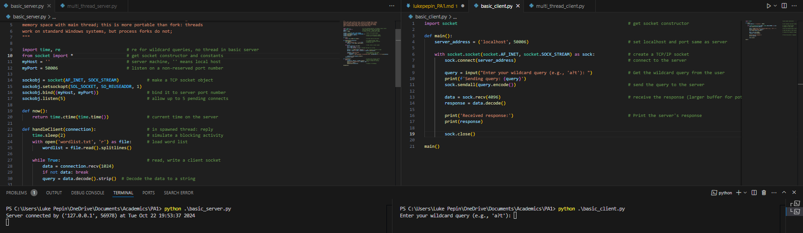
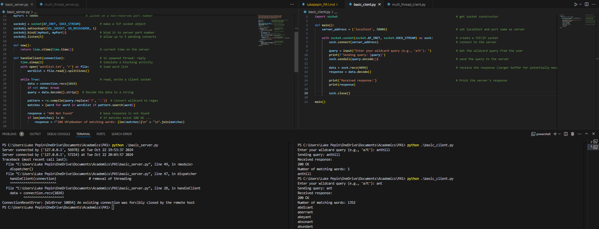
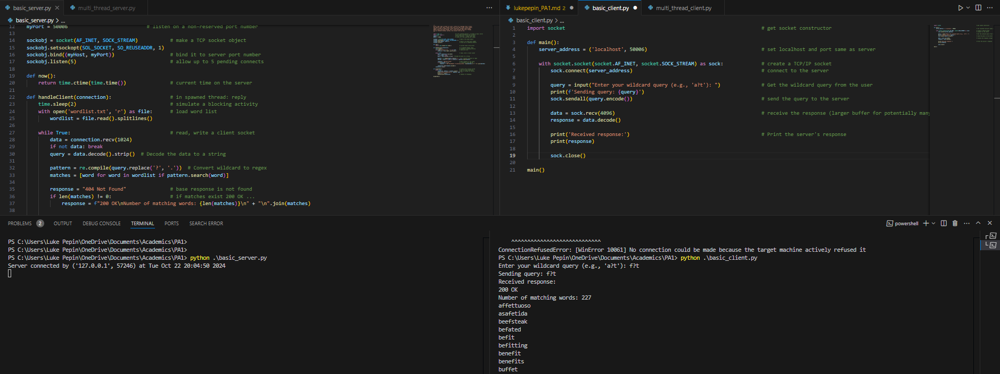
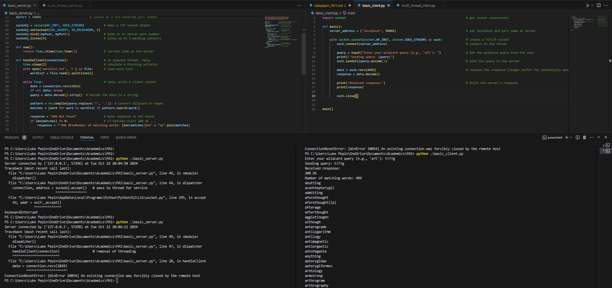
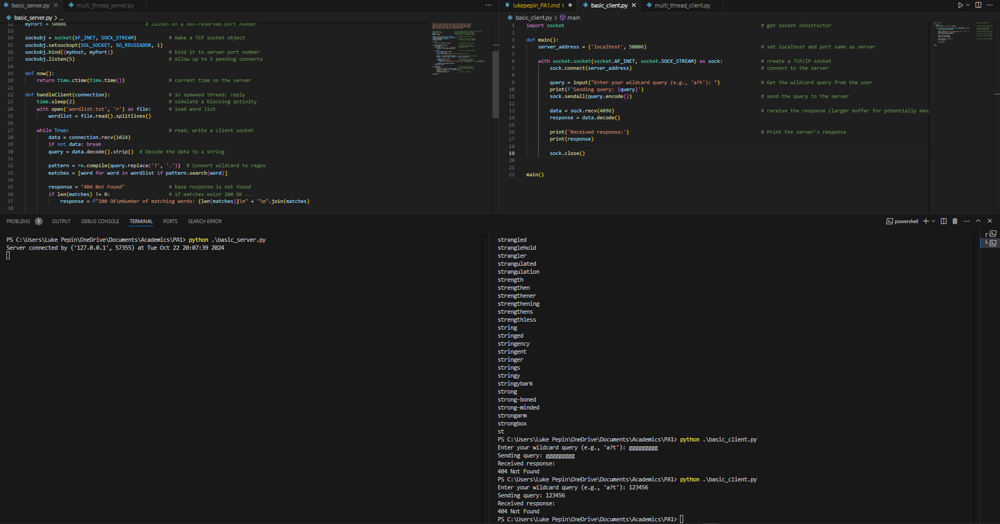
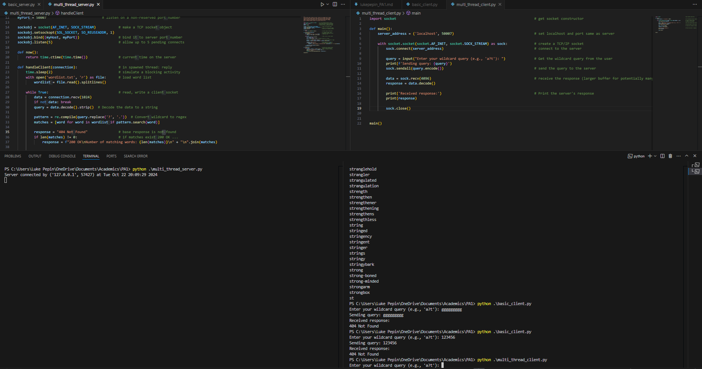
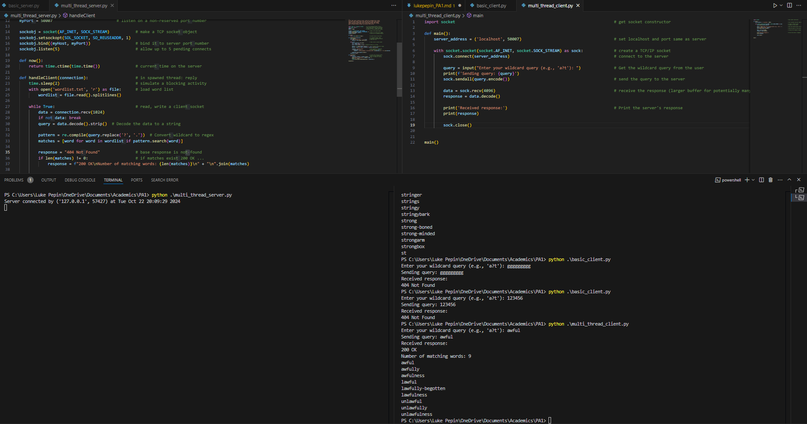
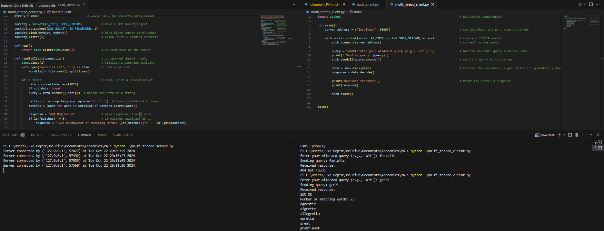
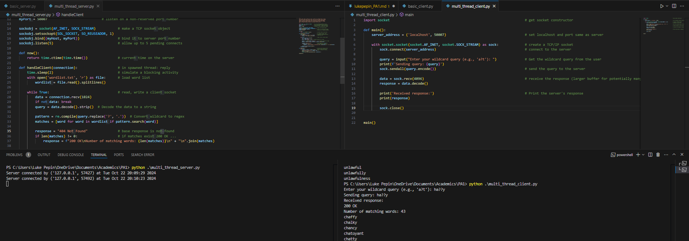
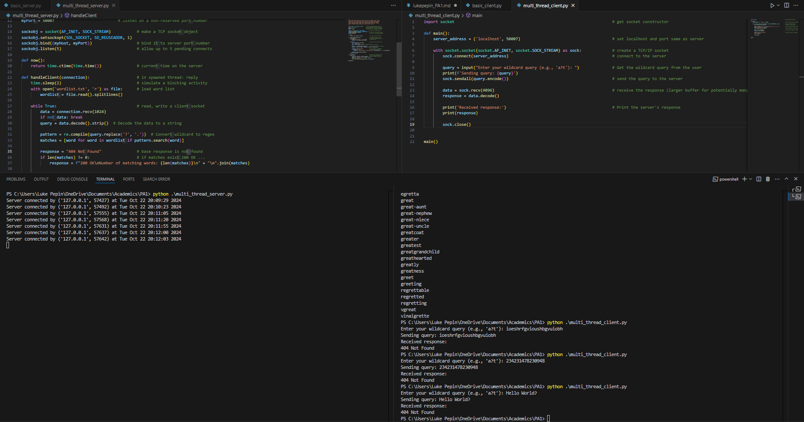

# Design Document for Multi-Threaded Server and Client

Luke Pepin, CSE 3300, Tuesday October 22, 2024

## Description

**Overall Program Design:**
The basic and multi-threaded server and client program is designed to handle wildcard queries for English words stored in a word list. The server listens for incoming connections from clients, processes their queries, and returns matching words. The client sends queries to the server and displays the results. The server can handle multiple clients simultaneously by spawning a new thread for each client connection. Both pairs of programs are modified versions of the starter code thread-server.py as provided in the assignment folder.

**How It Works:**

The server initializes a TCP socket, binds it to a specified port, and listens for connections. Upon accepting a connection, it spawns a new thread to handle the client. Each thread processes the client’s query by converting the wildcard pattern to a regular expression, searching the word list for matches, and sending the results back to the client. The server responds with a status code (200 OK or 404 Not Found), the number of matching words, and the list of matching words.The client initializes a TCP socket, connects to the server, prompts the user to enter a wildcard query, sends the query to the server, receives the response, and displays the results.

The client initializes a TCP socket, connects to the server, prompts the user to enter a wildcard query, sends the query to the server, receives the response, and displays the results.(From both sets of Client/Server Pairs)

The application protocol involves the client sending a query string with the possibility of containing the wildcard pattern `?`, and the server responding with a status code, the number of matching words, and the list of matching words. The response is determined directly by three lines (modifyed for publishing):

* response= 404 Not Found
* if length of matches != 0
  * response = 200 OK, length of matches, matches ...

## **Tradeoffs**

Design tradeoffs include choosing threading over forking due to its portability across different operating systems, including Windows. Threads share the same memory space, which simplifies the management of shared resources and reduces overhead compared to forking, where each process has its own memory space. Regular expressions were chosen for their flexibility and power in pattern matching, allowing for complex queries and efficient searching. Blocking I/O was selected for its simplicity, as each thread handles a client connection in a straightforward manner, avoiding the complexity and potential debugging challenges associated with non-blocking I/O.

## Extensions

The two most beneficial extensions to the programs are keeping the client open until a ‘quit’ value is sent, allowing for continued searches without reconnecting, and improving error handling. Keeping the client open enhances user experience by enabling multiple queries in a single session, reducing the overhead of repeated connections. Improved error handling addresses common issues such as the ConnectionResetError: [WinError 10054], which occurs when the connection is forcibly closed by the remote host. This can be mitigated by providing more detailed error messages and handling edge cases more gracefully, ensuring a more robust and user-friendly application.

## Test Cases

For each Server/Client pair the following test cases were conducted to show the functionality of the code:

1. Setup: The Server/Client are both executable codes and wait for the client query.
2. Basic Success: A basic query with no wildcards is successfully ran.
3. Wildcard Success: A wildcard query is successfully ran.
4. Multi Wildcard Success: A Multi Wildcard query is successfully ran
5. Invalid Query: An invalid query is ran displaying 404 Not Found.

## **Screenshots:**

Screenshots of each test are in the section below. (Please note: Image formatting with new software has been difficult, errors may occur)

### Basic Server/Client Screenshots

### Multi-Thread Server/Client Screenshots

Image 5: 
