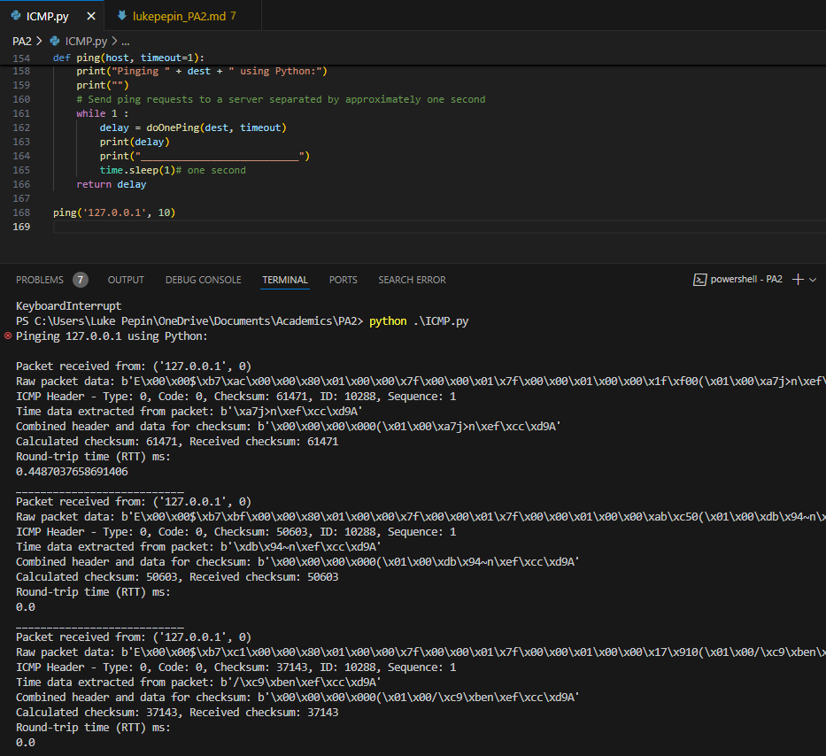
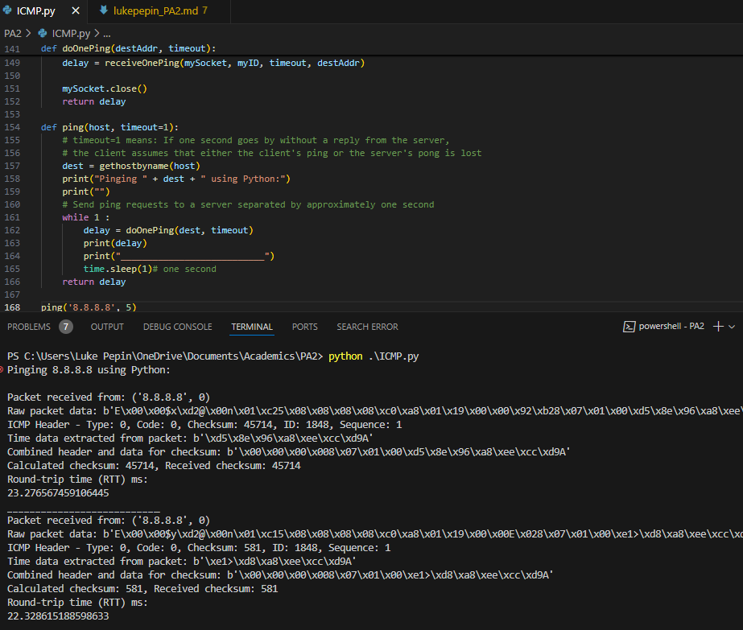
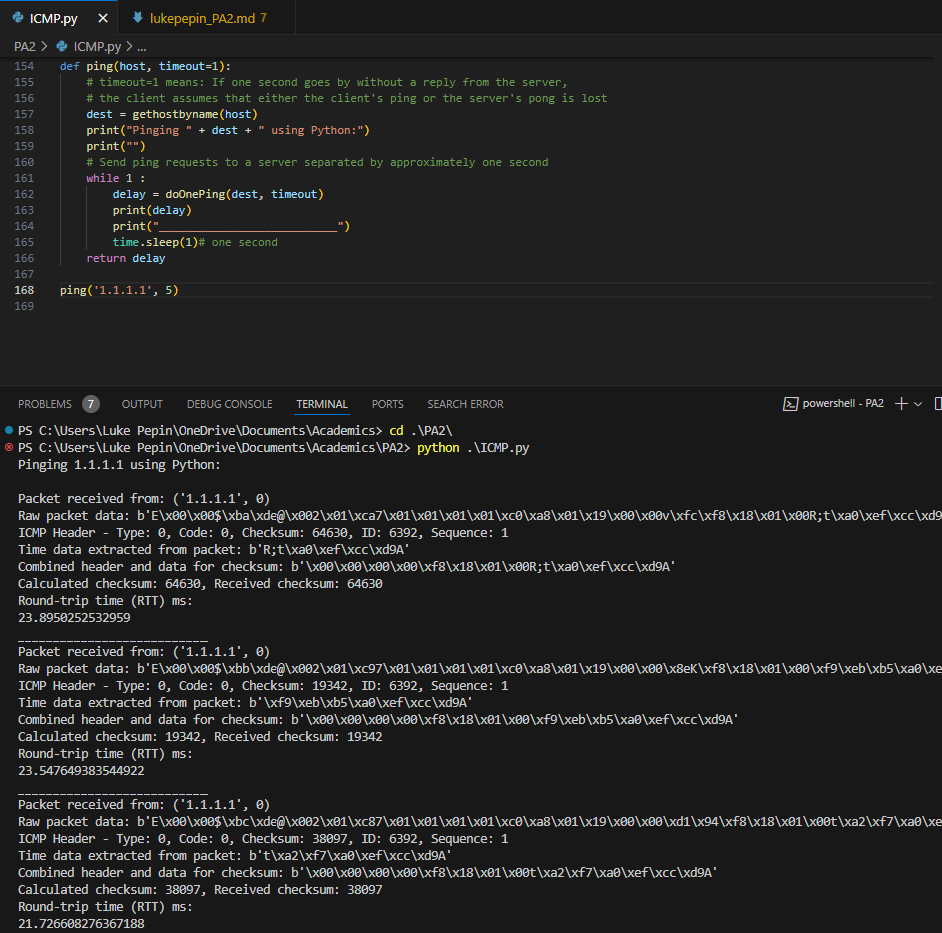
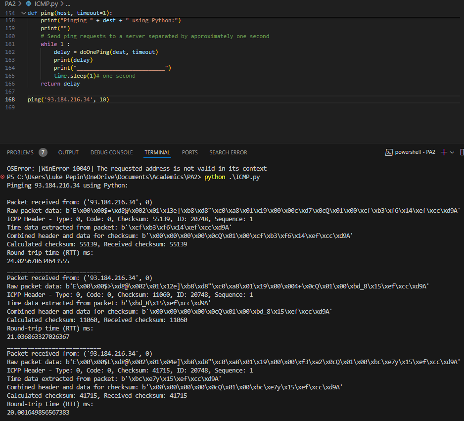
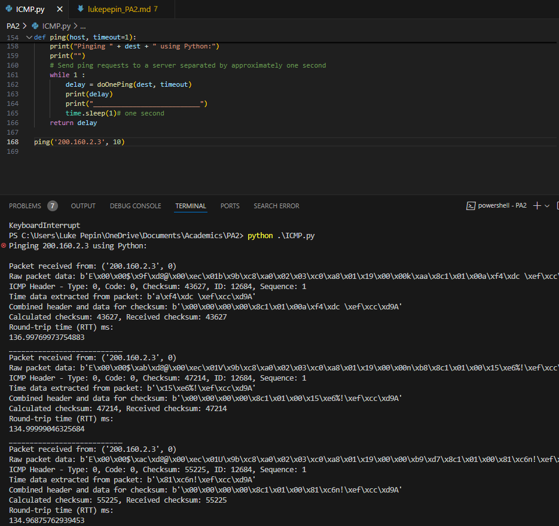
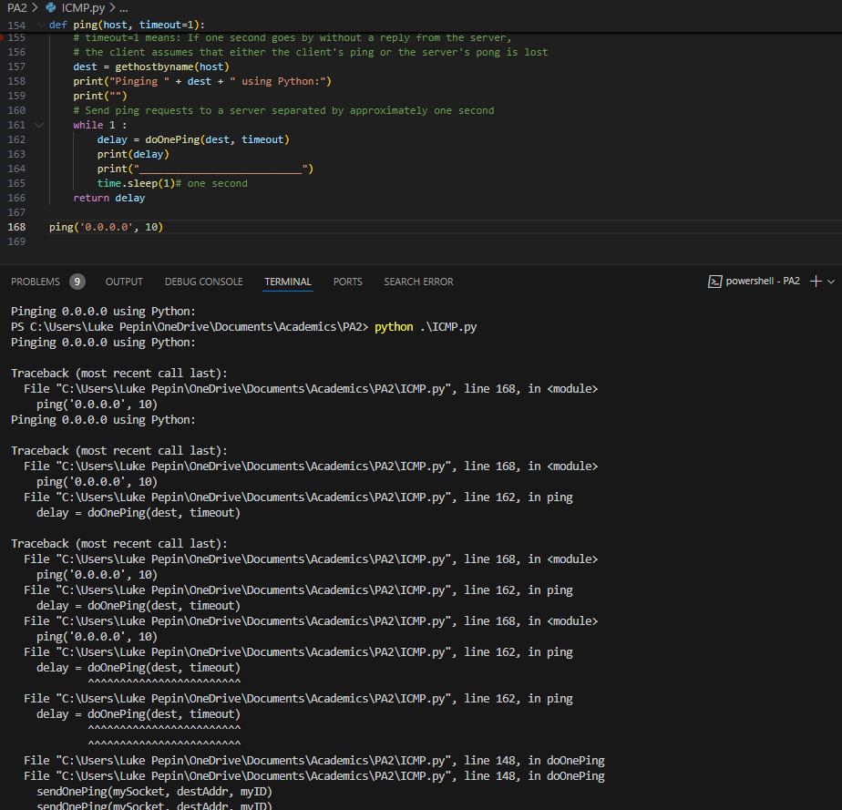
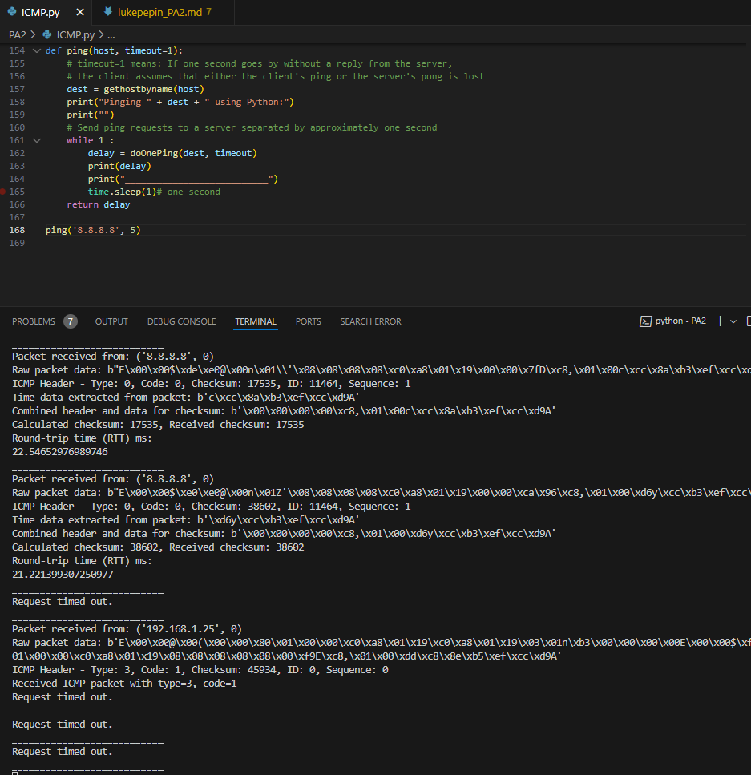

# Design Document for ICMP Pinger Lab and Raw Sockets

Luke Pepin, CSE 3300, Tuesday November 12, 2024

## Description

**Overall Program Design:**
The program is a Ping application using ICMP to send request and reply messages to a specified host. The application estimates the round-trip time (RTT) for each packet by comparing the sending time and receiving time. It consists of functions for sending and receiving ICMP packets, calculating checksums, and handling timeouts. The main components interact through raw sockets to facilitate low-level network communication, ensuring accurate timing and packet handling.

**How It Works:**
The program begins by creating a raw socket and constructing an ICMP echo request packet with a checksum and a timestamp. This packet is sent to the target host, and the program waits for an echo reply. Upon receiving a reply, the program extracts the timestamp from the packet, calculates the RTT, and prints the result. This process repeats at one-second intervals, providing continuous feedback on the network latency.

## Detailed Explanation of Code Between #Fill in Start and #Fill in End:

* **Extracting and Printing Packet Information** :
  * Extracts the ICMP header from the packet.
  * Unpacks the header using `struct.unpack("bbHHh", ICMPheader)` to get type, code, checksum, ID, and sequence number.
* **Verifying the Packet** :
  * Checks if the ICMP type is 0 (echo reply) and if the received ID matches the sent packet ID.
  * If valid, extracts the time data from the packet.
* **Checksum Calculation** :
  * Reconstructs the ICMP header with a zeroed checksum field and combines it with the time data.
  * Calculates the checksum and converts it to network byte order using `htons(calculatedChecksum & 0xffff)`.
  * Compares the calculated checksum with the received checksum.
* **Calculating RTT** :
  * If checksums match, extracts the sending time from the time data.
  * Calculates RTT by subtracting the sending time from the receiving time and converts it to milliseconds.
  * Returns the RTT.

## Tradeoffs

The main tradeoff in this design is balancing simplicity and functionality. By focusing on key features like RTT measurement and basic error handling, the program is easy to understand and use. However, this simplicity might affect its accuracy and robustness in more complex network environments.

## Extensions

Possible extensions to the program include:

- Adding support for more ICMP message types.
- Implementing better error handling.
- Enhancing the user interface to show detailed statistics like packet loss rate and RTT standard deviation.
- Adding command-line options to specify the number of pings and the TTL value.

## Test Cases

As described in the programming assignment document, the following test cases were conducted with their respective screenshots below: Sending packets to localhost, Sending packets to different continents (North America, Asia, Europe, South America), Incorrect IP, and Data loss.

## Screenshots

1. Sending packets to localhost (127.0.0.1)

   *Due to localhost often Time.time() is not preicse enough to measure the extremely fast time 0.0ms

   
2. Sending packets to different continents:

   1. North America (8.8.8.8)

      
   2. Asia (1.1.1.1)

      
   3. Europe (93.184.216.34)

      
   4. South America (200.160.2.3)

      
3. Incorrect IP (0.0.0.0)

   
4. Data Loss (127.0.0.1 + Disconnect During Program)

   

## Cases Code Does Not Function

- The program may not function correctly if the network conditions are highly unstable, leading to frequent packet loss.
- It may also fail if the target host does not respond to ICMP echo requests due to firewall settings or other network security measures.
